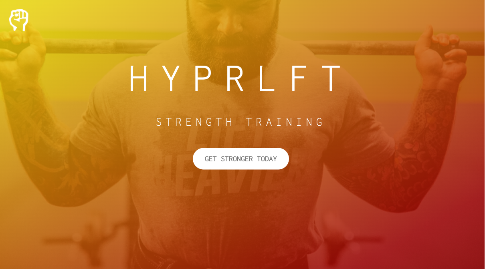

# hyprlft

## Description

This project is a landing page created for a fictional company that offers personal training and strength training services. It is created and designed with HTML and CSS and styling compiled with SASS. It was used as a learning tool to incorporate modern and advanced CSS techniques.

## Application

[Link to application](https://pswk1.github.io/hyprlft/)

## Languages and Technologies

- Javascript
- HTML
- CSS
- SASS

## Installation and Usage

1. Clone this repository to your machine

```
git clone https://github.com/pswk1/avatarMatch
```

2. Switch to repository

```
cd avatarMatch
```

3. Open index.html in browser

```
right click index.html and open in browser
```

4. Thank you for visiting this project!


